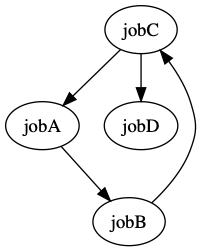

# concourse pipelines to dot graphs

Usage

```bash
fly -t ci get-pipeline -p concourse | \
  pipeline2dot | \
  dot -Tpng > graph.png
```

Result


### why?

At the moment, the Concourse web ui can't deal with some cases of cyclic dependencies.


E.g., consider the following pipeline:

```yaml
jobs:
  - name: jobA0
    plan:
      - get: res-1

  - name: jobA
    plan:
      - get: res-1
        passed: [jobC]

  - name: jobB
    plan:
      - get: res-1
        passed: [jobA]

  - name: jobC
    plan:
      - get: res-1
        passed: [jobB]

resources:
  - name: res-1
    type: time
    source: {interval: 2m}
```

Such pipeline has the following layout:



which brakes the UI (for now).


This tool can help you figure out where you introduced that cycle that is crashing your UI.


### caveats

It currently doesn't support the non `step`-based `in_parallel` format
(anything coming directly from `fly -t $target get-pipeline`) will work though
(as it converts to `step`-based).

e.g., the following won't work

```
jobs:
- name: aa
  plan:
    - in_parallel:
      - get: bla
```

but this, will:


```
jobs:
- name: aa
  plan:
    - in_parallel:
        steps:
        - get: bla
```

